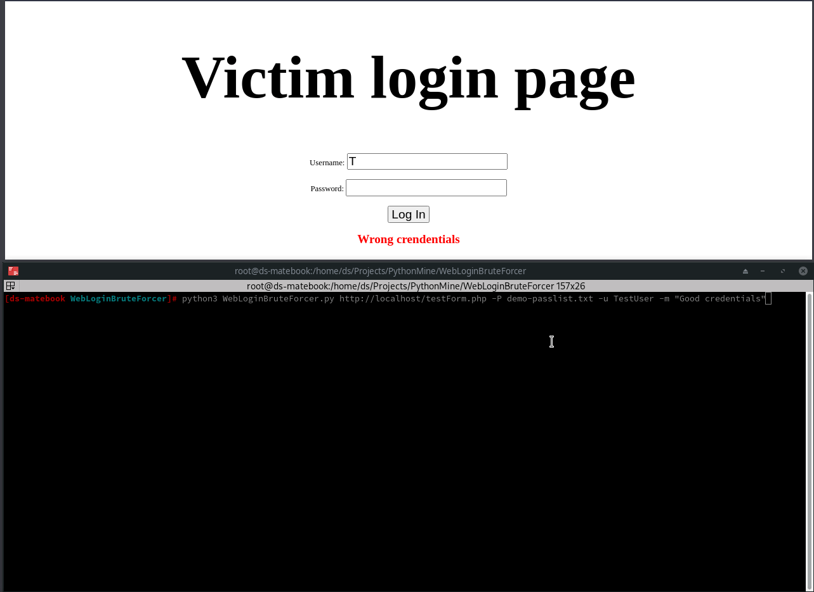

# WebLoginBruteForcer

## Description:
### Simple Web Login Brute Forcer Python program created for educational purposes.

## Prerequisites
1. You must have a working http server containing the testForm.php file
2. Or you can use any vulnerable login page out there.

